# Astroturf

Astroturf is a regulatory intelligence platform for detecting coordinated public comment campaigns in federal rulemaking. It ingests public comments from sources such as regulations.gov and FCC ECFS, parses and embeds comment text, clusters repeated or semantically similar submissions, and exports evidence packets for human review. The system is built around replayable agents on a Databricks/Delta Lake medallion architecture, with a Next.js dashboard for exploring dockets, clusters, and analysis status.

> Public comments are public data, but campaign detection is probabilistic. Astroturf produces evidence packets with caveats; it should not be used to accuse organizations or individuals without human review and corroborating evidence.

## What Problem It Solves

Federal agencies can receive thousands or millions of comments on a single proposed rule. Coordinated campaigns often use boilerplate templates, small wording changes, or personalized prefaces that defeat exact-duplicate matching. Astroturf helps reviewers group related comments by meaning, inspect representative language, quantify campaign scale, and trace whether similar language appears in final rule text.

## Architecture

Agents communicate through Delta tables, not in-memory messages. Each stage is idempotent on a stable primary key and can be replayed independently.

```mermaid
flowchart LR
    Ingest["IngestionAgent<br/>regulations.gov / FCC ECFS"] --> Bronze["bronze.raw_comments"]
    Bronze --> Parse["ParserAgent<br/>parse/enrich comments"]
    Parse --> SilverParsed["silver.parsed_comments"]
    SilverParsed --> Embed["EmbeddingAgent<br/>mock/local/Databricks BGE"]
    Embed --> SilverEmb["silver.comment_embeddings"]
    SilverEmb --> Cluster["ClusteringAgent<br/>exact hash / cosine / Vector Search"]
    Cluster --> GoldClusters["gold.comment_clusters<br/>gold.comment_cluster_memberships"]
    GoldClusters --> Attribute["AttributionAgent<br/>evidence packets"]
    GoldClusters --> Migrate["MigrationAgent<br/>language migration checks"]
    Attribute --> GoldEvidence["gold.campaign_attributions"]
    Migrate --> GoldEvidence
    GoldClusters --> Export["demo.cluster_review_export"]
    GoldEvidence --> Export
    Export --> UI["Next.js reviewer UI"]
```



### Agent Pipeline

- `IngestionAgent`: pulls public comments from regulations.gov v4 and FCC ECFS into `bronze.raw_comments`.
- `ParserAgent`: creates normalized parsed comment rows and optional detail/attachment side tables.
- `EmbeddingAgent`: writes comment embeddings using a mock backend, local sentence-transformers backend, or Databricks Foundation Model API (`databricks-bge-large-en`).
- `ClusteringAgent`: writes exact duplicate and semantic campaign clusters into gold tables.
- `AttributionAgent`: creates caveated campaign-origin evidence packets. Current public-safe mode is `offline_seed`; web/LLM research modes require additional configuration.
- `MigrationAgent`: checks whether cluster language appears in final-rule excerpts and records caveated phrase-level evidence.

### Medallion Tables

- Bronze: `bronze.raw_comments`
- Silver: `silver.parsed_comments`, `silver.comment_details`, `silver.comment_attachments`, `silver.comment_embeddings`
- Gold: `gold.comment_clusters`, `gold.comment_cluster_memberships`, `gold.campaign_attributions`, `gold.rule_migrations`
- Demo/export: `demo.cluster_review_export`

## Databricks Integration

Astroturf is designed for Databricks Serverless and Unity Catalog while still supporting local development:

- Delta Lake for durable stage boundaries.
- Unity Catalog schemas for bronze/silver/gold/demo organization.
- MLflow for agent-run parameters, row counts, quality metrics, and timing.
- Databricks Foundation Models for production embeddings.
- Databricks Vector Search for scalable semantic neighbor lookup.
- Databricks Jobs API for hosted `/analyze` requests from the web UI.

Production credentials and workspace identifiers are never committed. Configure them through environment variables, GitHub/Vercel secrets, or Databricks secrets.

## Local Quickstart

Prerequisites:

- Python 3.11
- `uv`
- Node.js 20+

Install Python dependencies:

```powershell
uv sync
```

Run backend tests:

```powershell
.uv-test-venv\Scripts\python.exe -m pytest
```

Run local lint/format checks:

```powershell
.uv-test-venv\Scripts\python.exe -m ruff check .
.uv-test-venv\Scripts\python.exe -m ruff format --check .
```

## UI Quickstart

The UI can run without Databricks credentials using fallback/mock data.

```powershell
cd ui
npm install
$env:ASTROTURF_DATA_MODE = "mock"
npm run dev
```

Open `http://localhost:3000`.

Useful UI commands:

```powershell
npm run lint
npx tsc --noEmit
npm run build
```

`npm run dev` uses webpack for Windows stability. `npm run dev:turbo` remains available for explicit Turbopack testing.

## Configuration

Copy the examples and fill in local values:

```powershell
Copy-Item .env.example .env
Copy-Item ui\.env.example ui\.env.local
```

Important environment variables:

- `ASTROTURF_DATA_MODE=mock|live|auto`
- `ASTROTURF_DELTA_BACKEND=auto|spark|delta_rs`
- `DATA_GOV_API_KEY` for api.data.gov-backed public APIs. `REGULATIONS_GOV_API_KEY` remains a deprecated fallback.
- `DATABRICKS_HOST`, `DATABRICKS_TOKEN`, `DATABRICKS_HTTP_PATH`, `DATABRICKS_CATALOG`, `DATABRICKS_DATA_ROOT`, `DATABRICKS_REPO_PATH` for live Databricks execution.
- `DATABASE_URL` for the hosted UI control plane.

See [docs/databricks/README.md](docs/databricks/README.md) for deployment details and [SECURITY.md](SECURITY.md) for secret-handling guidance.

## Databricks Deployment Path

At a high level:

1. Create a Databricks workspace with Unity Catalog enabled.
2. Create target schemas such as `<catalog>.bronze`, `<catalog>.silver`, `<catalog>.gold`, and `<catalog>.demo`.
3. Configure a SQL Warehouse and capture its HTTP path.
4. Configure access to the `databricks-bge-large-en` Foundation Model endpoint.
5. Optionally create a Vector Search endpoint and index for semantic review workflows.
6. Sync this repository into a Databricks workspace repo.
7. Create a Databricks job that runs `notebooks/databricks/web_analysis_job.py` for hosted `/analyze` requests, or use `notebooks/databricks/workflow_tasks.py` for the sample/demo workflow.
8. Configure the web app with environment variables supplied at runtime.

## Evidence and Demo Artifacts

Small sample artifacts under `artifacts/` are retained to make the project understandable without a private Databricks workspace. Generated Delta tables, raw exports, local MLflow state, caches, and logs are ignored and should not be committed.

Public demo link: `<add-public-demo-url-after-deployment>`

## More Documentation

- [docs/README.md](docs/README.md): documentation map.
- [docs/architecture/architecture.md](docs/architecture/architecture.md): concise architecture overview.
- [docs/databricks/README.md](docs/databricks/README.md): Databricks configuration checklist.
- [docs/methodology/attribution-and-migration.md](docs/methodology/attribution-and-migration.md): evidence methodology and caveats.
- [docs/operations/end-to-end-pipeline-runbook.md](docs/operations/end-to-end-pipeline-runbook.md): local and Databricks runbook.
- [docs/decisions/](docs/decisions): architecture decision records.

## License

MIT. See [LICENSE](LICENSE).
