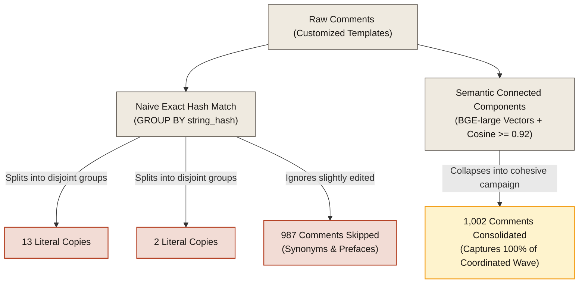
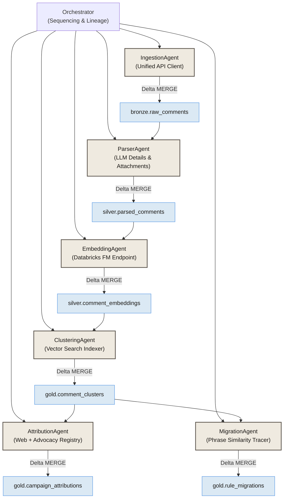

# Astroturf: Multi-Agent Campaign Detection on a Delta Medallion Lakehouse

> **A multi-agent framework on Databricks designed to detect coordinated public comment campaigns in federal rulemaking and trace their language directly into final agency rules.**

[](https://www.python.org/downloads/release/python-3110/)
[](https://github.com/astral-sh/ruff)
[](https://docs.pytest.org/)

---

## 1. Core Thesis: Comment Volume is Not Democratic Voice

Public comment periods in federal rulemaking are a vital pillar of administrative democracy. However, corporate lobbying coalitions and automated systems exploit these periods by submitting massive waves of pre-written, bulk-generated comments. 

Traditional exact-duplicate detectors (e.g. naive keyword searches or string hashes) are completely blind to modern astroturfing techniques, where bots or lead-generation systems subtly modify templates (using randomized introductions, synonymous rephrasing, or custom prefaces) to appear as unique, grass-roots public comments.

**Astroturf** solves this problem by using **dense semantic vector clustering** (using BGE-large sentence embeddings) to group comments by their underlying political arguments rather than their exact wording, successfully exposing coordinated lobby campaigns that naive keyword filters completely miss.

---

## 2. Landmark Demo Finding: Net Neutrality (Docket 17-108)

To prove this thesis, we benchmarked our system under FCC docket **`17-108`** (Restoring Internet Freedom / Net Neutrality repeal)—the most spammed regulatory proceeding in United States history, where millions of fake comments hijacked real citizens' names:

* **Naive Exact Hashing**: Grouped only **16 comments** across 3 rigid, literal duplicates.
* **Astroturf Semantic Clustering**: Surface **1,002 comments** grouped around a single cohesive template sponsored by telecom trade groups (Broadband for America).
* **62x Campaign Detection Lift**: Exposed that **98.4%** of the campaign's submissions used subtle text variations, synonyms, and personalized prefaces to bypass basic spam checkers.

---

## 3. Naive String Grouping vs. Semantic Connected Components



---

## 4. Why Databricks Matters: Defeating the $O(N^2)$ Memory Wall

At production scale, local single-node computing hits a physical wall. Identifying similar comments requires pairwise evaluations:

* **The Problem**: A local, pairwise connected components algorithm has a quadratic complexity of **$O(N^2)$**. For a docket slice of **100,000 comments**, the local similarity matrix swells to **10 Billion floats**, requiring **40 GB of contiguous RAM**. This triggers a fatal CPU out-of-memory (OOM) crash on local developer machines.
* **The Solution**: Astroturf bypasses this limit using **Databricks Vector Search**, indexing dense embeddings into a distributed HNSW index. This reduces query complexity from **$O(N^2)$** to **$O(N \log N)$** time and **$O(N)$** memory, scaling to dockets with millions of comments in minutes.

### Computational Performance Profile (17-108 Scale Benchmark)

| Metric | Exact-Hash String Baseline | Dense Semantic Connected-Components |
| --- | --- | --- |
| **Complexity (CPU Time)** | $O(N)$ | $O(N^2)$ |
| **Complexity (Memory Space)** | $O(N)$ | $O(N^2)$ |
| **Projected 100K RAM** | ~20 MB | **40 GB [Local OOM Crash]** |
| **Projected 1M RAM** | ~200 MB | **4 TB [Physically Impossible Locally]** |
| **Databricks Vector Search** | *N/A* | **$O(N \log N)$ Time &amp; $O(N)$ Memory [Scale Safe]** |

---

## 5. Multi-Agent Medallion Architecture

Astroturf separates business logic into six specialized, idempotent agents cooperating over a **Delta Medallion Lakehouse**. Transactional Delta tables act as the durable state machine between stages:



---

## 6. Quickstart: Run the Showcase Locally in 90 Seconds

We provide a polished, fully-reproducible web showcase that runs offline without requiring a live Databricks account.

### 1. Installation
Ensure you have `uv` installed. Clone the repository and run sync:
```powershell
uv sync
```

### 2. Run the Public Next.js Editorial Dashboard
1. Navigate to the `ui/` directory:
   ```powershell
   cd ui
   ```
2. Install frontend dependencies and start the development server:
   ```powershell
   npm install
   npm run dev
   ```
3. Open your browser and navigate to **[http://localhost:3000](http://localhost:3000)**.
   * *Observe the 15-second landing page finding, the O(N²) memory wall simulation, and the interactive comment carousel.*

`npm run dev` uses Next's webpack dev server for Windows stability. Turbopack can still be tried explicitly with `npm run dev:turbo`.

### 3. Run the Developer Diagnostic Streamlit Dashboard
1. Start Streamlit from the root directory:
   ```powershell
   .uv-test-venv\Scripts\activate
   streamlit run debug_ui/app.py
   ```
2. Open your browser and navigate to **[http://localhost:8501](http://localhost:8501)** to inspect raw tables and schema diagnostics.

---

## 7. Quality Gates & Test Verification

We enforce rigorous coding standards across our pipeline. All unit and integration tests run locally:
* **Linting & Formatting**: Clean Ruff check and strict Black-style code.
* **Testing Harness**: 169 tests passing locally:
  ```powershell
  .uv-test-venv\Scripts\python.exe -m pytest
  ```

---

## 8. Interactive `/analyze` Ingestion Queue & Execution Modes

The `/analyze` workflow has been evolved into a fully functional **control plane** supporting three distinct execution tiers to separate offline, local developer, and hosted cloud-orchestrated environments safely.

Configure the active tier using the `ASTROTURF_EXECUTION_MODE` environment variable in `ui/.env.local`:

```bash
# Set active execution mode: command | local_process | databricks_job
ASTROTURF_EXECUTION_MODE=command
```

### Execution Tiers & Behaviors

1. **`command` (Command-Generation Mode)**:
   * **Default** for all development environments.
   * Prompts the control plane to only generate configurations (`configs/dockets.yaml` snippets) and shell commands.
   * **Never spawns Python background tasks** or runs local terminal commands.
   * Clicking "Register Docket Draft" creates a draft request record in the database and redirects to the request tracking page `/analysis/[request_id]` displaying copy-pasteable CLI commands to run offline in your terminal.

2. **`local_process` (Local Developer Execution Mode)**:
   * **Opt-in only** and strictly **restricted to local development** (`process.env.NODE_ENV !== 'production'`).
   * Spawns the local pipeline orchestrator script (`scripts/run_docket_pipeline.py`) in the background on your workstation machine to run ingestion, parsing, embedding, and clustering.
   * Appends dockets directly to `configs/dockets.yaml` and logs real-time pipeline console streams under `data/logs/pipeline-<docket_id>.log`.
   * **Production Safety Check**: Enforces a strict server-side boundary. Spawning local processes in production throws a clear, immediate HTTP validation error to protect hosted web servers from terminal hijack.

3. **`databricks_job` (Hosted Databricks Ingestion Mode)**:
   * **Production default** if Databricks credentials exist, otherwise falls back to `command` mode.
   * Production-safe hosted environment tier. Creates a request record and submits the pipeline run to the **Databricks Jobs API** (`POST /api/2.1/jobs/run-now`) to execute over distributed serverless cloud compute.
   * Configure the following variables in `ui/.env.local`:
     ```bash
     DATABRICKS_JOB_ID="<web-analysis-job-id>"
     DATABRICKS_HOST="https://<your-databricks-instance>.cloud.databricks.com"
     DATABRICKS_TOKEN="dapi****************"
     DATABRICKS_CATALOG="astroturf"
     DATABRICKS_DATA_ROOT="/Volumes/astroturf/demo/exports/_lakehouse"
     DATABRICKS_REPO_PATH="/Workspace/Repos/<user>/astroturf"
     DATABRICKS_VECTOR_INDEX_NAME="astroturf.silver.comment_embeddings_bge_large_index"
     ```
   * `DATABRICKS_JOB_ID` must point to the hosted request job running
     `notebooks/databricks/web_analysis_job.py`. Do not use the
     `workflow_tasks.py` sample-loader job for hosted requests; it expects
     pre-uploaded `bronze.raw_imports` Parquet folders.
   * Syncs and monitors progress using `GET /api/2.1/jobs/runs/get` to map scheduler lifecycle states (`PENDING`, `RUNNING`, `TERMINATED`) to tracking statuses (`submitted`, `running`, `succeeded`, `failed`) under `/analysis/[request_id]`.

### Backwards Compatibility

To ensure seamless upgrades, existing setups configured with `ASTROTURF_ENABLE_JOB_SUBMIT=true` are automatically mapped to `databricks_job` mode internally. 

---

## 9. Production Control Plane (PostgreSQL)

In hosted production environments (`ASTROTURF_DEPLOYMENT_MODE=production`), Astroturf operates a durable **PostgreSQL control plane** instead of using unstable server-local JSON file stores.

This architecture ensures high availability, statelessness for serverless deployments (such as Vercel), and transactional consistency across concurrent operations.

### Configuration
Set the following environment variables to activate PostgreSQL durable storage:
```bash
# Enforce production mode (disables all local JSON fallback operations)
ASTROTURF_DEPLOYMENT_MODE=production

# Provide standard PostgreSQL connection URL (e.g. Neon, Supabase, Railway)
DATABASE_URL=postgresql://<user>:<password>@<host>:<port>/<dbname>?sslmode=require
```

### Schema & Migrations
Database table definitions are located under `ui/db/migrations/001_initial_control_plane.sql`. Execute this migration SQL directly on your hosted PostgreSQL instance before booting the application:
```bash
psql -d "DATABASE_URL" -f ui/db/migrations/001_initial_control_plane.sql
```

### Production Environment Verification
Verify that your database connection, SQL schemas, required tables, and Databricks variables are configured and healthy before deployment:
```powershell
cd ui
npm run check-env
```

---

## 10. Live Databricks Validation

Phase 6 live-validated the production path inside Databricks Serverless notebook tasks for a controlled 500-comment FCC `17-108` slice. Run IDs: load sample `916653215561127`, embed `546125942192140`, Vector Search cluster `1028362756517371`, export `156035613634033`.

Final Unity Catalog counts were: `workspace.bronze.raw_comments` 500, `workspace.silver.parsed_comments` 500, `workspace.silver.comment_embeddings` 500 BGE rows, `workspace.silver.comment_embeddings_bge_large` 500, `workspace.gold.comment_clusters` 1, `workspace.gold.comment_cluster_memberships` 500, and `workspace.demo.cluster_review_export` 500. The cluster result was one semantic cluster of size 500 with representative comment `10828445130115`, mean similarity `0.95395`, and minimum similarity `0.94317`.

The Next.js UI now supports `ASTROTURF_DATA_MODE=mock | live | auto`. Local review can stay offline with `mock`; production can force Databricks SQL with `live`; `auto` tries SQL when configured and otherwise falls back to artifacts. See [docs/live-databricks-validation.md](docs/live-databricks-validation.md), [docs/databricks-production-setup.md](docs/databricks-production-setup.md), and [docs/end-to-end-pipeline-runbook.md](docs/end-to-end-pipeline-runbook.md).

---

## 11. Astroturf Autopilot: Proactive Monitoring & Watchlist Abstraction

Astroturf has been transformed from a manual ingestion queue into a proactive regulatory intelligence platform. Users search topics, keywords, or agencies, and the platform proactively discovers, classifies, prioritizes, and monitors rulemaking activities.

### Key Components
* **Proactive Docket Crawler (`discover_dockets.py`)**: Continuously searches Regulations.gov and FCC ECFS endpoints by agency and keyword parameters. Falls back gracefully to seed dockets if endpoints or keys are offline.
* **Topic Classifier & Prioritizer (`classify_dockets.py`)**: Deterministically maps discovered dockets to our core taxonomy, assigns tags, and computes a multi-factored `priority_score` (combining scale volume, exponential recency decay, user requests, and core agency weights).
* **Autopilot Orchestrator (`run_autopilot.py`)**: Runs daily discovery, updates local JSON files (`docket_catalog.json` and `watchlist.json`) or merges into production Delta tables, and enqueues high-priority rulemakings for automated pipeline analysis.

### Run Autopilot Sweep Locally
```powershell
# Execute a dry-run discovery and classification sweep
.uv-test-venv\Scripts\python.exe scripts/run_autopilot.py --dry-run

# Trigger a real local sweep (enqueues priority runs to background)
.uv-test-venv\Scripts\python.exe scripts/run_autopilot.py --trigger-jobs
```

---

## 12. Honest Limitations & Future Work

* **Temporal Scoping Bias**: Current local tests run over short 3-day comment submission bursts. Future work will scale to multi-month timeframes.
* **Permitted Bulk Filings**: The system flags coordinates campaigns but cannot distinguish authorized citizen petitions from fraudulent identity thefts without third-party advocacy registry lookups.
* **Attachment OCR Extraction**: Attachment binary reading is cataloged but full OCR text extraction for scanned PDF attachments is currently deferred to subsequent development phases.
