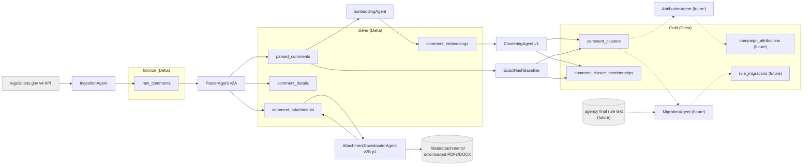

# System map

A plain-English snapshot of the Astroturf project: where it stands today, how the
pieces fit together, and what is still ahead. Pair this with
`docs/architecture/architecture.md` (authoritative spec), the ADRs in
`docs/decisions/`, and `docs/methodology/demo-story.md`
(intended final demo).

## What this project is

Astroturf is a multi-agent system that detects coordinated public comment
campaigns in federal rulemaking and traces their language into final rules. It
runs on a medallion lakehouse: bronze for raw `regulations.gov` records, silver
for parsed text and embeddings, gold for clusters, attributions, and rule-text
migrations. Agents communicate through durable Delta tables instead of
in-memory message passing, so each stage is independently replayable, testable,
and inspectable. The "agentic" parts are the `ParserAgent` (LLM-based
attachment extraction, deferred), the `AttributionAgent` (tool-using research,
future), and the `Orchestrator` (sequencing, future). Everything else is
analytical Spark/PyArrow logic wearing an agent costume — that distinction is
kept honest in the code and the ADRs.

## Data flow (current state)

Solid arrows are implemented. Dashed arrows are planned. `ExactHashBaseline` is
a deterministic literal-duplicate detector that writes into the same gold
tables as `ClusteringAgent`, distinguished by `clustering_version =
"v1_exact_hash"`.

## Medallion layer map

All paths below are **local** Delta tables today (delta-rs, no Spark). The
schemas are defined in `shared/schemas/` as Pydantic models with derived
PyArrow / PySpark schemas, per the codebase rule.

| Layer  | Table                                  | Path                                            | Status         | Written by                          |
|--------|----------------------------------------|-------------------------------------------------|----------------|-------------------------------------|
| Bronze | `bronze.raw_comments`                  | `./data/bronze/raw_comments`                    | Implemented    | `IngestionAgent`                    |
| Silver | `silver.parsed_comments`               | `./data/silver/parsed_comments`                 | Implemented    | `ParserAgent` v1 / v2A              |
| Silver | `silver.comment_details`               | `./data/silver/comment_details`                 | Implemented    | `ParserAgent` v2A                   |
| Silver | `silver.comment_attachments`           | `./data/silver/comment_attachments`             | Implemented    | `ParserAgent` v2A + Downloader      |
| Silver | `silver.comment_embeddings`            | `./data/silver/comment_embeddings`              | Implemented    | `EmbeddingAgent`                    |
| Gold   | `gold.comment_clusters`                | `./data/gold/comment_clusters`                  | Implemented    | `ClusteringAgent` + ExactHashBaseline |
| Gold   | `gold.comment_cluster_memberships`     | `./data/gold/comment_cluster_memberships`       | Implemented    | `ClusteringAgent` + ExactHashBaseline |
| Gold   | `gold.campaign_attributions`           | `./data/gold/campaign_attributions`             | Future         | `AttributionAgent`                  |
| Gold   | `gold.rule_migrations`                 | `./data/gold/rule_migrations`                   | Future         | `MigrationAgent`                    |

What each table holds:

- `bronze.raw_comments` — one row per comment from the `regulations.gov` list
  endpoint, plus the original `attributes` JSON for audit. Idempotent on
  `comment_id`.
- `silver.parsed_comments` — normalized text per comment: cleaned HTML body or
  title fallback, `text_source` label (`detail_comment_text`, `detail_cover_note`,
  `comment_text`, `title_only`, `missing`), normalized text hash, char count,
  attachment count.
- `silver.comment_details` — per-comment side table with the full
  `regulations.gov` detail JSON archived for replay, plus the substantive vs.
  cover-note classification. Designed so we never have to re-fetch the API to
  reprocess.
- `silver.comment_attachments` — one row per attachment file format. Holds the
  `regulations.gov` source URL, format, declared size, and download metadata
  (`local_path`, `checksum_sha256`, `downloaded_at`, `download_error`,
  `size_bytes_actual`) once the downloader has run.
- `silver.comment_embeddings` — dense vectors keyed by `(comment_id,
  embedding_model)`. Variable-size `pa.list_(pa.float32())` so multiple models
  can coexist (see ADR-0005). Cached by `text_hash` so re-runs are cheap.
- `gold.comment_clusters` — one row per detected cluster, scoped by
  `(docket_id, embedding_model, clustering_version)`. Stores cluster size,
  representative `comment_id`, similarity stats, and the similarity threshold.
- `gold.comment_cluster_memberships` — one row per `(cluster_id, comment_id)`,
  with the member's similarity to the representative. Same scoping key as
  `comment_clusters`.
- `gold.campaign_attributions` (future) — for each cluster, a probable origin
  (advocacy group, action portal, etc.) plus tool-using LLM evidence and a
  confidence score.
- `gold.rule_migrations` (future) — phrase- and section-level matches between
  campaign templates and the agency's final rule text.

## Agent-by-agent status

Each agent below has the same shape: what it does, what it reads, what it
writes, and current status. "Done" means implemented and exercised end-to-end
on a real docket; "partial" means implemented but with deferred sub-phases.

### IngestionAgent — done

- **What it does:** pulls every comment for a docket from `regulations.gov` v4
  with date-window cursoring to step past the 5,000-record-per-query cap, and
  exponential backoff via `tenacity` on 429 and 5xx.
- **Inputs:** `regulations.gov` v4 list endpoint; `docket_id`.
- **Outputs:** `bronze.raw_comments` via Delta MERGE on `comment_id`.
- **Status:** done. `agents/ingestion/agent.py`, CLI at
  `scripts/run_ingestion.py`. Logs an MLflow run per execution with row counts,
  API call counts, and duration. Validated end-to-end on CFPB-2016-0025 and
  EPA-HQ-OAR-2021-0317.

### ParserAgent — v1 + v2A done; v2B deferred

- **What it does:** normalizes per-comment text and side-loads each comment's
  full `regulations.gov` detail JSON, classifying substantive comments vs.
  cover-note pointers to attachments.
- **Inputs:** `bronze.raw_comments`; `regulations.gov` detail endpoint with
  `?include=attachments`; `max_detail_fetches` safety cap.
- **Outputs:** `silver.parsed_comments`, `silver.comment_details`,
  `silver.comment_attachments`.
- **Status:**
  - **v1 done** — deterministic title / body / missing parsing into
    `silver.parsed_comments` with normalized-text hashing and char/token counts.
  - **v2A done** — per-comment detail fetch, BeautifulSoup cleaning, substantive
    vs. cover-note classification, written in one pass into all three silver
    tables. Already-enriched `comment_id`s are skipped via a `comment_details`
    checkpoint, so reruns are cheap.
  - **v2B deferred** — PDF / DOCX text extraction, OCR fallback, LLM-assisted
    extraction, and reconciliation back into `parsed_comments` are not built
    yet. Most CFPB content lives in attachments, so this is the
    highest-leverage future work for substantive coverage. (See
    `docs/operations/attachment-extraction-plan.md` and ADR-0008.)
- **Module:** `agents/parser/agent.py`, CLI at `scripts/run_parser.py`.

### AttachmentDownloaderAgent — v2B phase 1 done

- **What it does:** streams each attachment binary referenced by
  `silver.comment_attachments` to disk, verifying size and computing a SHA-256
  checksum, so downstream extraction has stable local files.
- **Inputs:** pending rows from `silver.comment_attachments`.
- **Outputs:** files under `./data/attachments/...`; download metadata merged
  back into `silver.comment_attachments` (`local_path`, `checksum_sha256`,
  `downloaded_at`, `download_error`, `size_bytes_actual`).
- **Status:** phase 1 done. 25 MB per-file cap, allowed-extension filter
  (`pdf`, `doc`, `docx`, `txt`, `html`), Content-Length sanity check, atomic
  `.part`-then-rename writes. Schema evolution is handled automatically with
  the additive policy in ADR-0004. Phases 2–4 (text extraction, OCR fallback,
  LLM-assisted extraction, reconciliation back into `parsed_comments`) are not
  built yet.
- **Module:** `agents/downloader/agent.py`, CLI at
  `scripts/download_attachments.py`.

### EmbeddingAgent — done for comment-level embeddings

- **What it does:** embeds substantive comment text into dense vectors with a
  pluggable backend, cached on the normalized text hash.
- **Inputs:** substantive rows from `silver.parsed_comments` (`text_source` in
  `{detail_comment_text, comment_text}` and `parse_status == "parsed"`).
- **Outputs:** `silver.comment_embeddings` via Delta MERGE on `(comment_id,
  embedding_model)`.
- **Status:** done. Three backends today (per ADR-0005):
  - `MockBackend` — deterministic, hash-seeded unit-norm vectors. Used for the
    smoke test and unit tests; **not semantic**.
  - `LocalSentenceTransformerBackend` — `BAAI/bge-large-en-v1.5` via
    `sentence-transformers`, byte-identical to the production model.
  - `DatabricksFoundationModelBackend` — Databricks SDK-backed route to
    `databricks-bge-large-en` with a safe default batch size of 16; mock-tested
    locally, pending an approved live Databricks run.
- **Module:** `agents/embedding/agent.py`, CLI at `scripts/run_embedding.py`.

### ClusteringAgent — v1 done for local single-docket / single-model runs

- **What it does:** detects near-duplicate clusters as connected components in
  a cosine-similarity graph over a docket's embeddings.
- **Inputs:** non-mock rows from `silver.comment_embeddings`, scoped by
  `docket_id` and `embedding_model`; a cosine `threshold`.
- **Outputs:** scoped replacement into `gold.comment_clusters` and
  `gold.comment_cluster_memberships`, plus an MLflow run with candidate count,
  pair count, edge count, cluster count, and membership count.
- **Status:** v1 done. Pairwise cosine over non-mock embeddings by default,
  connected components above threshold, scoped replacement keyed by
  `(docket_id, embedding_model, clustering_version)` so re-runs are safe (see
  ADR-0006). MinHash/LSH candidate generation is deferred until the all-pairs
  cosine path becomes a bottleneck.
- **Module:** `agents/clustering/agent.py`.

### ExactHashBaseline — done

- **What it does:** runs alongside `ClusteringAgent` to surface literal
  duplicates by grouping comments whose `normalized_text_hash` matches exactly.
  Acts as a sanity baseline next to the semantic-embedding clustering.
- **Inputs:** substantive rows from `silver.parsed_comments`.
- **Outputs:** writes into the same gold tables as `ClusteringAgent`, tagged
  with `clustering_version="v1_exact_hash"`,
  `embedding_model="normalized_text_hash"`, and
  `embedding_backend="exact_hash"`.
- **Status:** done. CLI at `scripts/run_exact_hash_baseline.py`. Surfaces only
  literal duplicates by construction, so it is the floor — anything the
  embedding clusterer finds beyond this is paraphrase-driven.

### AttributionAgent — future

- **What it does (planned):** the first stage that is genuinely agentic. A
  tool-using LLM agent (web search + advocacy-registry lookup) that traces a
  cluster's template back to a probable origin (advocacy group, action portal,
  partisan campaign, …).
- **Inputs (planned):** `gold.comment_clusters` representative text + sample
  members; the web; an advocacy registry.
- **Outputs (planned):** `gold.campaign_attributions` with origin, evidence
  links, and a confidence score.
- **Status:** not started.

### MigrationAgent — future

- **What it does (planned):** cross-references cluster templates against the
  agency's final rule text for phrase- and section-level matches.
- **Inputs (planned):** `gold.comment_clusters` representative templates;
  agency final rule text (PDF/HTML).
- **Outputs (planned):** `gold.rule_migrations` with phrase and section
  citations and a similarity score.
- **Status:** not started.

## Running checkpoints

### CFPB-2016-0025 — pipeline shape

CFPB-2016-0025, the CFPB arbitration rule, is the running pipeline-shape
smoke test. It is large enough to be interesting and small enough to keep on a
laptop.

| Stage                                                   | Count    |
|---------------------------------------------------------|----------|
| Bronze rows ingested                                    | 211,885  |
| Unique `comment_id` values in bronze                    | 211,885  |
| Duplicate `comment_id`s in bronze                       | 0        |
| Silver rows in `parsed_comments` (current sample)       | 250      |
| `text_source = detail_cover_note` rows in the sample    | 239      |
| `text_source = detail_comment_text` rows in the sample  | 11       |
| Cataloged attachment rows in `comment_attachments`      | 937      |
| Real BGE embeddings written to `comment_embeddings`     | 11       |
| Real-embedding clustering at threshold 0.92             | 1 cluster, 2 memberships |

Of the 250 sampled comments, only 11 had substantive in-line body text. The
other 239 were cover notes that referred to attachments. This is the important
shape of the docket and the reason attachment text extraction is the
highest-leverage next step. The clustering signal on the in-line text alone is
small because most of the campaign content sits in the attachments.

### EPA-HQ-OAR-2021-0317 — campaign evidence

EPA-HQ-OAR-2021-0317, the EPA methane-pollution rule, is the running
campaign-evidence demo. Its substantive content sits in in-line text rather
than attachments, so the same pipeline produces strong clusters end-to-end
today.

| Stage                                                     | Count |
|-----------------------------------------------------------|-------|
| Substantive `detail_comment_text` rows considered         | 396   |
| Exact-hash baseline: literal duplicate clusters           | 7     |
| Exact-hash baseline: literal duplicate memberships        | 16    |
| Exact-hash baseline: largest literal cluster size         | 4     |
| Embedding clustering (`databricks-bge-large-en`, t=0.92): clusters | 13    |
| Embedding clustering: campaign-like memberships           | 162   |
| Embedding clustering: primary cluster size                | 123   |

What this says, in plain English: literal copy-paste alone catches a handful
of duplicate filings. The semantic embedding clusterer surfaces an order of
magnitude more campaign-like comments by recognizing paraphrases of the same
template — and one template cluster dominates at 123 comments. The Markdown
review for these clusters lives at
`data/exports/cluster_evidence_EPA-HQ-OAR-2021-0317.md`.

### Test and lint status

- 92 unit tests passing.
- Ruff clean. Ruff format clean.

## What is Databricks-ready vs. still local

### Local today

- All Delta I/O runs through `delta-rs` (`deltalake`), not Spark. Local Delta
  tables live at `./data/{bronze,silver,gold}/...`. See ADR-0002 for why.
- MLflow tracking is local: every agent run writes a run with parameters
  (docket, paths, caps), metrics (row counts, fetch counts, duration), and
  timing into the local `mlruns/` store.
- The debug UI is a Streamlit app at `debug_ui/app.py`. **It is an internal
  developer inspection tool, not the final product UI.** It now includes
  exact-hash baseline inspection, cluster campaign-style classification, and
  full cluster evidence panels.
- Embeddings can run with the `LocalSentenceTransformerBackend`
  (`BAAI/bge-large-en-v1.5`), which is the same model family as the planned
  Databricks Foundation Model.

### Databricks-shaped, but not yet wired

- `DatabricksFoundationModelBackend` is implemented against the Databricks SDK
  for the `databricks-bge-large-en` endpoint with a safe default batch size of
  16; the remaining proof is an approved live Databricks run on promoted
  sample data.
- Tables are written in real Delta format, so a Databricks workspace can mount
  or copy `./data/...` and read them directly without a re-format pass.
- Spark `StructType`s are derived from the same Pydantic models, so a Spark
  rewrite of a hot path is mechanical, not a redesign.

### Intentionally future

- **Unity Catalog** governance and table identities
  (`astroturf.bronze.raw_comments` etc. as Unity Catalog three-part names
  rather than file paths). See `docs/databricks/integration.md`.
- **Databricks Vector Search** index sync over `silver.comment_embeddings`,
  filtered by `embedding_model` to satisfy the fixed-dimension index
  requirement (see ADR-0005 and `docs/databricks/vector-search.md`).
- **Databricks Workflows** for production orchestration
  (`infra/workflows/main.yml` is the eventual home; the local orchestrator is
  the dev driver until then).

## Known gaps

- **Most CFPB substantive text lives in attachments.** Without v2B phases 2–4,
  the system sees cover letters and misses the campaign content underneath
  them.
- **Attachment text extraction is not done.** `AttachmentDownloaderAgent` puts
  files on disk, but nothing extracts text or OCRs scanned pages yet.
- **No live Databricks Foundation Model run yet.** The backend is mock-tested;
  the live run on promoted sample data is gated on explicit workspace approval.
- **Databricks Vector Search is not wired.** No index, no sync job, no Unity
  Catalog entry.
- **No final product UI.** The Streamlit debug app inspects bronze, silver,
  and gold tables for engineering work; it is not the demo UI and is not
  intended to be.

## Next engineering milestones (in order)

1. Run the Databricks Foundation Model backend on a Databricks-flavored path
   once live workspace access is explicitly approved (batch safety default of
   16 already integrated).
2. Stand up a minimal demo UI (Streamlit or Databricks App) that reads
   `gold.comment_clusters` and lets a reviewer click into a cluster and see
   sample comments and a submission-time spike chart.
3. ParserAgent v2B phases 2–4: PDF / DOCX text extraction, OCR fallback for
   scanned PDFs, LLM-assisted extraction for the awkward cases, and
   reconciliation back into `silver.parsed_comments` so the embeddings see the
   substantive content, not just the cover letters.
4. Databricks Vector Search integration: model-filtered index sync over
   `silver.comment_embeddings`, with the cluster prototype switched to use it
   for candidate retrieval.
5. `AttributionAgent` and `MigrationAgent` over the gold layer.
