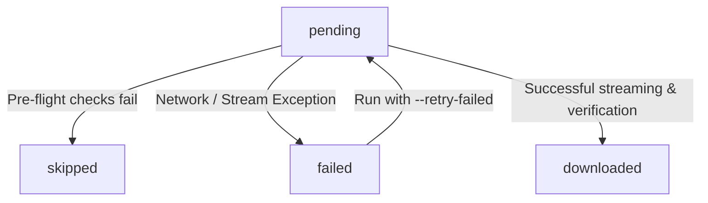

# ParserAgent v2B Attachment Downloader Documentation

The Attachment Downloader Agent (`AttachmentDownloaderAgent`) is a safe, atomic, and bounded pipeline component that reads metadata cataloged in the Silver medallion layer, streams the files from Regulations.gov (or external CDNs) using `httpx`, verifies their integrity, and persists them under a raw attachments directory.

---

## 1. Storage Architecture

To avoid bloating the transactional logs of the Delta Lake table structure, raw unstructured binaries (e.g. PDFs, Word documents) are separated from the structured schemas in `data/silver/comment_attachments`.

Raw binaries are stored using this logical filesystem hierarchy:
```
data/attachments/
└── {docket_id}/
    └── {comment_id}/
        └── {attachment_id}.{format}
```

### Example
For an attachment with ID `EPA-HQ-OAR-2021-0317-0001_attachment_1` under comment `EPA-HQ-OAR-2021-0317-0001` in format `pdf`, it will be written to:
`data/attachments/EPA-HQ-OAR-2021-0317/EPA-HQ-OAR-2021-0317-0001/EPA-HQ-OAR-2021-0317-0001_attachment_1.pdf`

---

## 2. Download Lifecycle & Status States

Each cataloged attachment moves through a transactionally-tracked lifecycle in the Delta Table database. The `download_status` field takes one of four values:



*   `pending`: Default state after cataloging by `ParserAgent v2A`. Ready to be downloaded.
*   `skipped`: Automatically set when a safety threshold or whitelist check triggers a fast-fail:
    *   The file extension is not in `['pdf', 'doc', 'docx', 'txt', 'html']`.
    *   The file `Content-Length` header exceeds `--max-file-mb`.
*   `failed`: An error occurred during download or checksumming (e.g., HTTP 404, 500, network timeouts, or missing `file_url`). The error message is stored in `download_error`.
*   `downloaded`: File successfully saved atomically, verified, hashed (SHA-256), and size-logged.

---

## 3. Safety Safeguards

To prevent accidental bandwidth depletion or downloading excessively large files, multiple safety boundaries are enforced:

1.  **Whitelist Validation**: Only safe document formats (`pdf`, `doc`, `docx`, `txt`, `html`) are allowed. Other extensions are marked `skipped` immediately without network calls.
2.  **Max Count Limit (`--max-downloads`)**: Halts execution immediately upon reaching the specified count (default: `10`), leaving remaining records `pending` for subsequent runs.
3.  **Pre-stream size check**: Reads the `Content-Length` header in a streaming HTTP GET request. If it exceeds `--max-file-mb` (default: `25` MB), the connection is closed immediately and marked `skipped`.
4.  **Mid-stream byte counter**: If the server omits `Content-Length`, data is read progressive chunk-by-chunk. If the size exceeds the cap mid-stream, the connection is aborted, the partial `.part` file is deleted, and the record is marked `failed`.
5.  **Atomic Writing**: Files are always streamed to a temporary `.part` file. Only after size checks pass and the stream closes successfully is the file hashed and renamed to its final path.

---

## 4. Run CLI Interface

Execute the agent using the CLI harness:
```bash
uv run python scripts/download_attachments.py --docket {docket_id} [options]
```

### CLI Arguments
*   `--docket` (Required): The Regulations.gov Docket ID to process.
*   `--attachments-path` (Default: `./data/attachments`): Root directory where raw files are stored.
*   `--attachments-table-path` (Default: `./data/silver/comment_attachments`): Path to the Delta table database.
*   `--max-downloads` (Default: `10`): Max number of attachments to download in this run.
*   `--max-file-mb` (Default: `25`): Safety cap limit in megabytes per file.
*   `--retry-failed` (Flag): If set, attempts to retry downloading previously marked `failed` attachments.
*   `--force-download` (Flag): Overwrites existing files on disk and recalculates metadata.
*   `--log-level` (Default: `INFO`): Logging level control (`DEBUG`, `INFO`, `WARNING`, `ERROR`).

---

## 5. Smoke Testing (PowerShell / Command Prompt)

To verify the pipeline end-to-end safely, you can perform a bounded 3-file smoke-run using these commands:

### Step 1: Run Ingestion & Cataloging (if not already done)
```powershell
# 1. Ingest raw comments to Bronze
uv run python scripts/run_ingestion.py --docket EPA-HQ-OAR-2021-0317 --max-rows 20

# 2. Parse and catalog attachments to Silver (v2A)
uv run python scripts/run_parser.py --docket EPA-HQ-OAR-2021-0317 --max-rows 10 --max-detail-fetches 10
```

### Step 2: Run Bounded Smoke Download (v2B)
```powershell
uv run python scripts/download_attachments.py --docket EPA-HQ-OAR-2021-0317 --max-downloads 3
```

### Step 3: Run Diagnostics UI
Launch the Streamlit dashboard to visually inspect download statuses and telemetry:
```powershell
uv run streamlit run debug_ui/app.py
```
*   Navigate to the **White-Box Diagnostics** section.
*   Open the **Comment Attachments Catalog** tab.
*   Confirm metrics cards update (Downloaded: 3, size matches, and local paths/hashes are visible).
