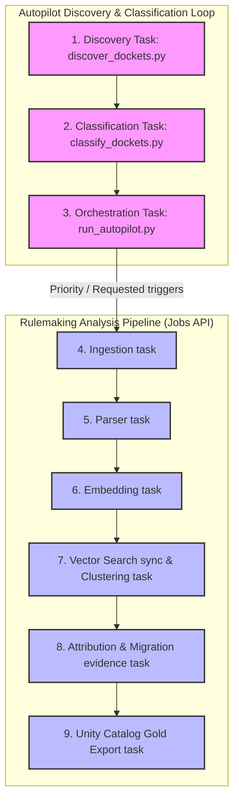

# Databricks Autopilot Production Runbook

This document details the scheduled workflow design, job parameters, failure handling, recovery runbooks, and validation criteria for Astroturf Autopilot in production.

---

## 1. Scheduled Production Workflow Design

In the production Unity Catalog environment, Autopilot runs as a multi-task **Databricks Workflow** scheduled to execute daily (or hourly during high-activity rulemaking periods) on **Serverless Compute** to minimize spin-up latency and operational costs.



### Task Parameters & Unified Configuration

Every Autopilot run carries standardized configuration parameters resolved via Databricks job parameters:

- `docket_id`: `"all"` or specific docket ID override.
- `mode`: `"databricks"` (forces production catalog targets instead of local fallbacks).
- `catalog`: Unity Catalog name (defaults to `"workspace"` or `"production"`).
- `trigger_jobs`: `"true"` (enables active Jobs API triggers for priority candidates).
- `max_dockets`: `"10"` (limits maximum discovered candidates per run to control compute bounds).

---

## 2. Control Plane Execution Mode Settings

The web control plane leverages `ASTROTURF_EXECUTION_MODE` to control how Autopilot sweeps and priority trigger requests behave. Configure this in `ui/.env.local`:

```bash
# Options: command | local_process | databricks_job
ASTROTURF_EXECUTION_MODE=command
```

* **`command` (Command-Generation Mode)**: (Default) Clicking **Trigger Autopilot Sweep** or **Request Analysis** will not trigger any background Python scripts. The UI reports the action, logs the request, and outputs manual commands for local execution.
* **`local_process` (Local Dev Mode)**: Opt-in only. Triggering a sweep spawns `scripts/run_autopilot.py --trigger-jobs` in the local background. This mode throws a **strict validation error** if run on a hosted production server.
* **`databricks_job` (Hosted Production Mode)**: Submits triggers to the Databricks Jobs API using:
  ```bash
  DATABRICKS_AUTOPILOT_JOB_ID="<your-databricks-autopilot-workflow-job-id>"
  ```
  If this variable is defined, clicking **Trigger Autopilot Sweep** in `/monitor` submits a bearer token-authenticated trigger to `POST /api/2.1/jobs/run-now` to run the scheduled crawler immediately. If not defined, it safely schedules the request in the catalog queue for the daily cron workflow.

---

## 2. Recovery & Maintenance Operations

### A. Local Validation & Dry Run
Before promoting code changes to the Databricks production workspace repo, run the complete dry-run validation suite locally:

```bash
# Test broad Regulations.gov/ECFS discovery fallback
.uv-test-venv/Scripts/python.exe scripts/discover_dockets.py --dry-run

# Run full Autopilot sweep dry-run including classification
.uv-test-venv/Scripts/python.exe scripts/run_autopilot.py --dry-run --trigger-jobs
```

### B. Resolving Stalled Cursors
If a highly active docket stalls during the automated ingestion stage with a `CursorStalledError` (occurring when more than 5,000 comments share the exact same `lastModifiedDate` timestamp), run manual division:

1. Locate the stalled docket in `/monitor` or `workspace.discovery.docket_catalog`.
2. Access the **Advanced Config** panel at `/analyze`.
3. Split the date window manually by setting a tighter `start_date` and `end_date` boundary in the parameters to cursor past the bottleneck.
4. Manually re-trigger the job with the segmented date range.

### C. Manual Priority Overrides
If an urgent rulemaking docket must be analyzed immediately regardless of its computed Autopilot priority score:
1. Navigate to `/discoveries` in the web control plane.
2. Click **"Request Analysis"** on the target docket.
3. This increments `user_requested_count` and triggers an immediate classification sweep, raising the priority score above the threshold and auto-scheduling a run.

---

## 3. Freshness & Processing Status Taxonomy

Consistent and honest status labeling is maintained across the entire system. We map backend Delta `processing_status` values to frontend `CoverageStatus` labels:

| Backend `status` | UI Label | Meaning / Rationale |
| :--- | :--- | :--- |
| `discovered` | `"Discovered"` | Found by crawler; awaiting user vote or priority threshold. |
| `queued` / `queued` | `"Queued for analysis"` | Scheduled for the next scheduled Databricks run. |
| `analyzing` | `"Analyzing"` | Databricks Job is currently active (ingesting, embedding, or clustering). |
| `analyzed` | `"Analyzed"` | Semantic dossier is fully computed and available. |
| `stale` | `"Stale"` | Ingested rule is older than 6 months without new public filings. |
| `failed` | `"Failed"` | Ingestion or vector indexing encountered an unrecoverable failure. |

---

## 4. Monitoring & Alerting Setup

1. **System Health Metrics**: Autopilot runs emit metrics directly to MLflow under the `astroturf-databricks-orchestration` experiment.
2. **Slack / PagerDuty Integration**: Databricks Workflows are configured with email/webhook notifications:
   - On Start: `Silent`
   - On Failure: Direct alert webhook to `#alerts-regulatory-intel` with logs and traceback.
   - On Duration Exceeded: Trigger if any Autopilot task runs longer than 60 minutes.
