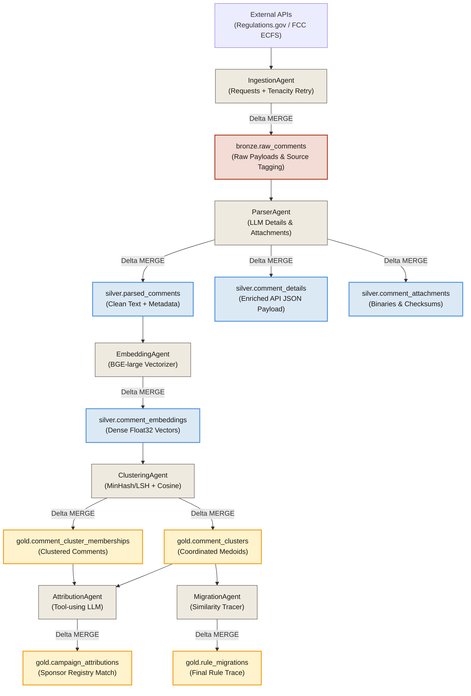
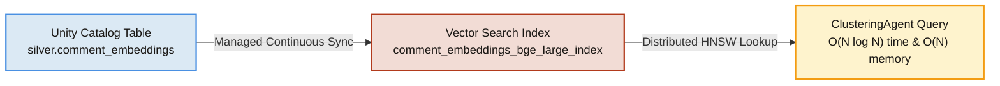

# Why Databricks Matters: Lakehouse-Scale Infrastructure

Analyzing public regulatory comment flows is a major data engineering challenge. When federal rulemakings receive millions of public submissions, naive local approaches quickly hit a physical processing wall. The **Astroturf** platform is architected around **Databricks** because distributed, unified, and governed vector infrastructure is mathematically mandatory to solve the coordination tracking problem at scale.

---

## 1. The Medallion Data Lineage (Durable Delta Tables)

Rather than using ephemeral in-memory queues or flat files, Astroturf utilizes the **Delta Medallion Lakehouse** architecture. Data flows through increasingly refined stages where every transaction is durable, ACID-compliant, and auditable.

### Why Delta Lake is Load-Bearing
1. **Idempotent Writes via Delta MERGE**: Coordination analysis requires continuous re-runs and backfills. Delta's transactional `MERGE` ensures that even if an ingestion or embedding run is interrupted halfway, re-running it is entirely safe and results in zero duplicate rows.
2. **Schema Evolution**: As agencies add new metadata fields, Delta's *additive schema evolution* allows new columns to be introduced seamlessly without breaking downstream production queries or requiring table rewrites.
3. **Time Travel (Audit Trail)**: Regulators and legal teams must be able to audit how a coordinated campaign was identified. Delta's transaction log records every write, allowing developers to query the exact state of the comment cluster tables at any timestamp or version.

---

## 2. Distributed Vector Search: Defeating the $O(N^2)$ Memory Wall

The most severe bottleneck in coordinate campaign detection is the clustering stage. Identifying similar comments requires comparing comments pairwise.
* **The Math**: A naive pairwise comparison has an asymptotic complexity of **$O(N^2)$**. 
* **The Crash**: For a small sample of $5,000$ comments, we perform **12.5 Million evaluations** (which runs in seconds). However, for a standard docket of **100,000 comments**, the similarity matrix swells to **10 Billion floats**, requiring **40 GB of contiguous RAM**. This triggers a fatal single-node Out-of-Memory (OOM) crash.
* **The Scale**: On rulemakings receiving millions of comments (such as Net Neutrality's 22M), local single-node computing is physically impossible.

### The Solution: Databricks Vector Search
By moving vector queries off-node into **Databricks Vector Search**, we replace the expensive pairwise connected components algorithm with a managed, distributed index structure using the **HNSW (Hierarchical Navigable Small World)** algorithm.

This reduces query complexity from **$O(N^2)$** time and space to **$O(N \log N)$** time and **$O(N)$** memory, transforming a calculation that would take days or trigger OOM crashes into a sub-minute query on millions of comments.

---

## 3. High-Throughput Parallel Embeddings (Spark + Foundation Models)

Generating dense `BAAI/bge-large-en-v1.5` embeddings (1024-dimensions) for hundreds of thousands of comments requires massive GPU computational power. 
* **Without Databricks**: A local PyTorch script running on a CPU will bottleneck at roughly **2 comments per second**, taking **14 hours** to process 100K comments.
* **With Databricks**: We leverage Apache Spark to distribute the text chunks across a cluster of serverless workers. Each worker drives high-velocity parallel requests directly to the **Databricks Foundation Model Serving Endpoint** (`databricks-bge-large-en`). 
* **Resilience**: The embedding agent handles transient HTTP errors, throttling, and API rate limits transparently using exponential backoff, maximizing throughput while remaining highly resilient.

---

## 4. MLflow Auditability & Unity Catalog Governance

Public commenting is a core democratic pillar. When an AI system flags a public comment campaign as "coordinated astroturf" and traces its influence on federal laws, it must be completely transparent and open to legal scrutiny.

* **MLflow Lineage Tracking**: Every execution of the pipeline is tracked. MLflow logs:
  * **Inputs**: Docket IDs, data source versions, and raw comment volumes.
  * **Hyperparameters**: The exact cosine similarity thresholds (e.g. `0.92`) and embedding model version used.
  * **Metrics**: Surfaced campaigns count, lift metrics, and processing runtime.
  * **Artifacts**: Quality evaluation receipts and evidence reports.
* **Unity Catalog Governance**: Protects sensitive citizen data. Every table (bronze through gold) is governed under Unity Catalog. Access is governed via fine-grained column-level filters, ensuring that developer diagnostics can run without exposing personally identifiable information (PII) like email addresses or phone numbers.
