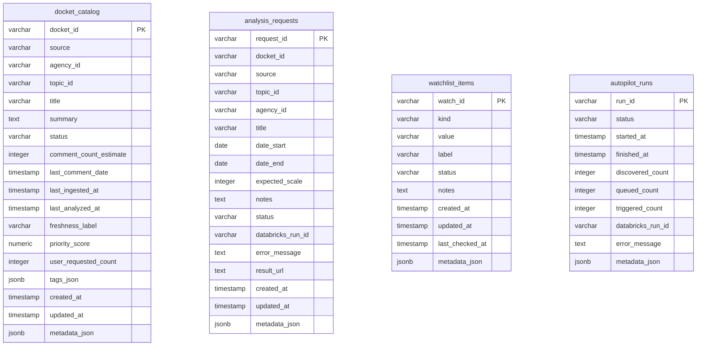

# Astroturf Hosted Production Deployment Guide

This document outlines the architecture, environment configurations, database migrations, and production readiness checks required to run the Astroturf control plane in a hosted cloud environment (e.g., Vercel, AWS, GCP, Railway) with a PostgreSQL backend (e.g., Neon, Supabase, Vercel Postgres) and Databricks as the high-scale execution engine.

---

## Production Core Principles

1. **PostgreSQL as the Control Plane System of Record**:
   - In production (`ASTROTURF_DEPLOYMENT_MODE=production`), local JSON files are **never** read or written.
   - All catalog cached items, watched items, and analysis requests are stored durably in PostgreSQL.
   - The web server fails loudly if database connectivity or migrations are incomplete.

2. **No Local Process Spawning**:
   - Spawning Python scripts, triggering local background processes, or writing local pipeline logs is strictly disabled.
   - All campaign detection and data pipelines must be run in the Databricks lakehouse via the Jobs API.
   - Any attempt to trigger local execution in production returns a clear HTTP 400/403 validation error.

---

## 1. Database Setup & SQL Migrations

Astroturf works with any database-as-a-service provider that supports standard PostgreSQL connection strings, such as **Neon**, **Supabase**, **Vercel Postgres**, **Railway**, or **Amazon RDS**.

### Provisioning the Database
1. Provision a PostgreSQL instance (v14+ recommended) and retrieve the connection URL:
   ```env
   <postgres-connection-url-with-ssl>
   ```

2. Run the initial schema migration script located at:
   [`ui/db/migrations/001_initial_control_plane.sql`](../../ui/db/migrations/001_initial_control_plane.sql)
   
   You can apply this SQL file directly via your hosted provider's SQL editor console or by running `psql` locally:
   ```bash
   psql -d "DATABASE_URL" -f ui/db/migrations/001_initial_control_plane.sql
   ```

### Relational Schema Diagram


---

## 2. Production Environment Variables Checklist

Set the following environment variables in your hosting provider's dashboard (e.g., Vercel, Render):

### Control Plane Settings
| Variable | Value / Description | Required? |
| :--- | :--- | :---: |
| `ASTROTURF_DEPLOYMENT_MODE` | `production` (enforces strict Postgres storage and disables local spawn) | **Yes** |
| `ASTROTURF_EXECUTION_MODE` | `databricks_job` (routes execution triggers through Databricks Jobs API) | **Yes** |
| `DATABASE_URL` | Connection URL to your hosted PostgreSQL database instance | **Yes** |

### Databricks Pipeline Settings
| Variable | Value / Description | Required? |
| :--- | :--- | :---: |
| `DATABRICKS_HOST` | Workspace URL (e.g. `https://<databricks-workspace-host>`) | **Yes** |
| `DATABRICKS_TOKEN` | Personal Access Token (PAT) with run permissions | **Yes** |
| `DATABRICKS_JOB_ID` | Job ID whose task runs `notebooks/databricks/web_analysis_job.py` | **Yes** |
| `DATABRICKS_CATALOG` | Unity Catalog target for hosted request outputs, e.g. `astroturf` | **Yes** |
| `DATABRICKS_DATA_ROOT` | Delta working root, e.g. `/Volumes/astroturf/demo/exports/_lakehouse` | **Yes** |
| `DATABRICKS_REPO_PATH` | Workspace repo path containing `agents/` and `shared/` | **Yes** |
| `DATABRICKS_VECTOR_INDEX_NAME` | Vector Search index, e.g. `astroturf.silver.comment_embeddings_bge_large_index` | *Optional* |
| `DATABRICKS_AUTOPILOT_JOB_ID` | Job ID of the Databricks scheduled autopilot sweep job | *Optional* |

`DATABRICKS_JOB_ID` must not point at the old sample-loader workflow based on
`notebooks/databricks/workflow_tasks.py`. That workflow expects pre-uploaded
Parquet under `bronze.raw_imports`; hosted production analysis requests use
`web_analysis_job.py`, which ingests from the public source API.

> [!WARNING]
> Ensure `ASTROTURF_DEPLOYMENT_MODE` is explicitly set to `production`. Without this, the serverless UI layer might fall back to local JSON files when DATABASE_URL is missing, resulting in silent data loss on server restarts/lambda cold-starts.

---

## 3. Pre-Deployment Readiness Check

To guarantee that a hosted deployment will succeed and connect correctly without runtime issues, execute the environment check utility before deploying.

### Running locally or in CI/CD:
Ensure you populate your `.env` or set environment variables in your terminal shell, then execute:

```bash
cd ui
npm run check-env
```

**The script validates:**
- Environment variable syntax and existence.
- Successful handshake connection to PostgreSQL using `DATABASE_URL` (bypassing local SSL validation when appropriate).
- Existence of all required tables (`docket_catalog`, `analysis_requests`, `watchlist_items`, `autopilot_runs`).
- Handshake availability of Databricks variables (`DATABRICKS_HOST`,
  `DATABRICKS_JOB_ID`, `DATABRICKS_CATALOG`, `DATABRICKS_DATA_ROOT`,
  `DATABRICKS_REPO_PATH`, etc.).

If any step fails, the check outputs a clear troubleshooting guide and exits with code `1`, preventing invalid builds from proceeding.

---

## 4. Production API Flow Architecture

The Astroturf UI operates as a stateless Vercel-like Next.js frontend, reading from PostgreSQL and instructing Databricks to execute compute jobs.

```mermaid
sequenceDiagram
    actor User
    participant UI as Next.js Web Client
    participant API as Next.js API Routes (Stateless)
    database PG as PostgreSQL (Control Plane)
    participant DB as Databricks Jobs API

    User->>UI: Request Analysis on Docket
    UI->>API: POST /api/analysis
    Note over API: validateExecutionModeServer()<br/>(recheck deployment mode safety)
    API->>PG: INSERT INTO analysis_requests (status = 'draft')
    API->>DB: POST /api/2.1/jobs/run-now (notebook parameters)
    DB-->>API: Return run_id
    API->>PG: UPDATE analysis_requests SET status = 'submitted', run_id = ...
    API-->>UI: Return Request ID & Databricks Run ID
    UI->>User: Display Progress Dashboard (Polling)
    
    loop Every 5-10s (dashboard active)
        UI->>API: POST /api/analysis/[request_id]/refresh
        API->>DB: GET /api/2.1/jobs/runs/get?run_id=...
        DB-->>API: Status (PENDING/RUNNING/TERMINATED SUCCESS)
        API->>PG: UPDATE analysis_requests SET status = 'succeeded' / 'failed'
        API-->>UI: Return fresh status
    end
```

---

## 5. Deployment Step-by-Step Runbook

Follow these steps to deploy a fresh instance of the Astroturf control plane:

### Step 1: Provision the PostgreSQL Database
- Provision a Neon or Supabase serverless database (which scales to 0 to save costs).
- Copy the connection string.

### Step 2: Seed the Schema
- Open the SQL Query editor on your database provider dashboard.
- Copy/paste the entire contents of [`001_initial_control_plane.sql`](../../ui/db/migrations/001_initial_control_plane.sql) and execute it.
- Verify that the tables are present in the default schema.

### Step 3: Configure environment variables on host
- In Vercel, Netlify, AWS Amplify, or your selected hosting provider, configure the variables listed in the checklist.
- Set `ASTROTURF_DEPLOYMENT_MODE` to `production`.
- Set `ASTROTURF_EXECUTION_MODE` to `databricks_job`.
- Set your `DATABASE_URL`.

### Step 4: Deploy Next.js Web Client
- Connect your GitHub repository to your host.
- Build command: `npm run build`
- Output directory: standard Next.js build output.
- Deploy the app.

### Step 5: Post-Deployment Verification
- Navigate to the `/monitor` page to view the live Databricks status panels.
- Add a topic to your Watchlist under `/topics`. Verify it successfully saves and remains persistent on refresh.
- Run a search for an analyzed docket (e.g. `17-108`) to verify it pulls live clustered insights from the Unified Catalog.
