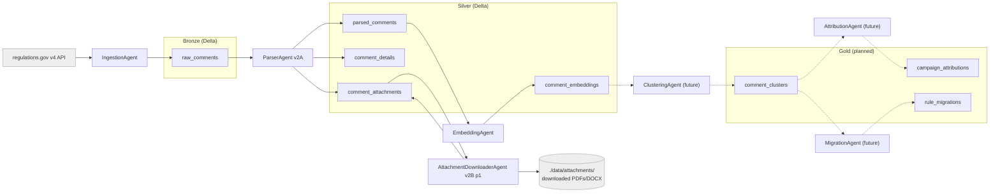

# System map

A plain-English snapshot of the Astroturf project: where it stands today, how the
pieces fit together, and what is still ahead. Pair this with `docs/architecture.md`
(authoritative spec), the ADRs in `docs/decisions/`, and `docs/demo-story.md`
(intended final demo).

## What this project is

Astroturf is a multi-agent system that detects coordinated public comment
campaigns in federal rulemaking and traces their language into final rules. It
runs on a medallion lakehouse: bronze for raw `regulations.gov` records, silver
for parsed text and embeddings, gold for clusters, attributions, and rule-text
migrations. Agents communicate through durable Delta tables instead of
in-memory message passing, so each stage is independently replayable, testable,
and inspectable. The "agentic" parts are the `ParserAgent` (LLM-based
attachment extraction, deferred), the `AttributionAgent` (tool-using research,
future), and the `Orchestrator` (sequencing, future). Everything else is
analytical Spark/PyArrow logic wearing an agent costume — that distinction is
kept honest in the code and the ADRs.

## Architecture diagram (current state)

Solid arrows are implemented. Dashed arrows are planned.

## Medallion layer map

All paths below are **local** Delta tables today (delta-rs, no Spark). The
schemas are defined in `shared/schemas/` as Pydantic models with derived
PyArrow / PySpark schemas, per the codebase rule.

| Layer  | Table                           | Path                                      | Status         | Written by                    |
|--------|---------------------------------|-------------------------------------------|----------------|-------------------------------|
| Bronze | `bronze.raw_comments`           | `./data/bronze/raw_comments`              | Implemented    | `IngestionAgent`              |
| Silver | `silver.parsed_comments`        | `./data/silver/parsed_comments`           | Implemented    | `ParserAgent` v1 / v2A        |
| Silver | `silver.comment_details`        | `./data/silver/comment_details`           | Implemented    | `ParserAgent` v2A             |
| Silver | `silver.comment_attachments`    | `./data/silver/comment_attachments`       | Implemented    | `ParserAgent` v2A + Downloader |
| Silver | `silver.comment_embeddings`     | `./data/silver/comment_embeddings`        | Implemented    | `EmbeddingAgent`              |
| Gold   | `gold.comment_clusters`         | `./data/gold/comment_clusters`            | Future         | `ClusteringAgent`             |
| Gold   | `gold.campaign_attributions`    | `./data/gold/campaign_attributions`       | Future         | `AttributionAgent`            |
| Gold   | `gold.rule_migrations`          | `./data/gold/rule_migrations`             | Future         | `MigrationAgent`              |

What each table holds:

- `bronze.raw_comments` — one row per comment from the `regulations.gov` list
  endpoint, plus the original `attributes` JSON for audit. Idempotent on
  `comment_id`.
- `silver.parsed_comments` — normalized text per comment: cleaned HTML body or
  title fallback, `text_source` label (`detail_comment_text`, `detail_cover_note`,
  `comment_text`, `title_only`, `missing`), normalized text hash, char count,
  attachment count.
- `silver.comment_details` — per-comment side table with the full
  `regulations.gov` detail JSON archived for replay, plus the substantive vs.
  cover-note classification. Designed so we never have to re-fetch the API to
  reprocess.
- `silver.comment_attachments` — one row per attachment file format. Holds the
  `regulations.gov` source URL, format, declared size, and download metadata
  (`local_path`, `checksum_sha256`, `downloaded_at`, `download_error`,
  `size_bytes_actual`) once the downloader has run.
- `silver.comment_embeddings` — dense vectors keyed by `(comment_id,
  embedding_model)`. Variable-size `pa.list_(pa.float32())` so multiple models
  can coexist (see ADR-0005). Cached by `text_hash` so re-runs are cheap.
- `gold.comment_clusters` (future) — near-duplicate clusters with size,
  representative template, similarity threshold, and the comment IDs in each
  cluster.
- `gold.campaign_attributions` (future) — for each cluster, a probable origin
  (advocacy group, action portal, etc.) plus tool-using LLM evidence and a
  confidence score.
- `gold.rule_migrations` (future) — phrase- and section-level matches between
  campaign templates and the agency's final rule text.

## Agent-by-agent status

### IngestionAgent — done

- `agents/ingestion/agent.py`. CLI wrapper at `scripts/run_ingestion.py`.
- Pulls all comments for a docket from `regulations.gov` v4, with date-window
  cursoring on `lastModifiedDate` to step past the API's 5,000-record-per-query
  cap, and exponential backoff via `tenacity` on 429 and 5xx.
- Writes `bronze.raw_comments` via Delta MERGE on `comment_id`. Re-runs are
  idempotent.
- Logs an MLflow run per execution with row counts, API call counts, and
  duration. Validated locally end-to-end on CFPB-2016-0025.

### ParserAgent — v1 + v2A done; v2B deferred

- `agents/parser/agent.py`. CLI wrapper at `scripts/run_parser.py`.
- v1: deterministic title / body / missing parsing into `silver.parsed_comments`
  with normalized-text hashing and char/token counts.
- v2A: per-comment `regulations.gov` detail fetch with `?include=attachments`,
  cleaned via BeautifulSoup, classified substantive vs. cover-note, and written
  in one pass into `silver.parsed_comments`, `silver.comment_details`, and
  `silver.comment_attachments`. Gated by `max_detail_fetches` as a hard safety
  cap. Already-enriched `comment_id`s are skipped via a `comment_details`
  checkpoint, so reruns are cheap.
- v2B (PDF / DOCX text extraction, OCR, LLM-assisted extraction, reconciliation
  back into `parsed_comments`) is **not built yet**. Most CFPB content lives in
  attachments, so this is the highest-leverage future work for substantive
  coverage.

### AttachmentDownloaderAgent — v2B phase 1 done

- `agents/downloader/agent.py`. CLI wrapper at `scripts/download_attachments.py`.
- Reads pending rows from `silver.comment_attachments`, streams each file with
  a 25 MB cap, allowed-extension filter (`pdf`, `doc`, `docx`, `txt`, `html`),
  Content-Length sanity check, atomic `.part`-then-rename writes, and SHA-256
  checksum.
- Writes results back into `silver.comment_attachments` via merge with five
  added fields (`local_path`, `checksum_sha256`, `downloaded_at`,
  `download_error`, `size_bytes_actual`). Schema evolution is handled
  automatically with the additive policy in ADR-0004.
- Phases 2–4 (extracting text from the downloaded files, OCR fallback, LLM
  extraction, and reconciling extracted text back into `parsed_comments`) are
  **not built yet**.

### EmbeddingAgent — done for comment-level embeddings

- `agents/embedding/agent.py`. CLI wrapper at `scripts/run_embedding.py`.
- Reads substantive rows from `silver.parsed_comments` (`text_source` in
  `{detail_comment_text, comment_text}` and `parse_status == "parsed"`), embeds
  them via a pluggable `EmbeddingBackend`, and merges into
  `silver.comment_embeddings`.
- Three backends today (per ADR-0005):
  - `MockBackend` — deterministic, hash-seeded unit-norm vectors. Used for
    the smoke test and unit tests; **not semantic**.
  - `LocalSentenceTransformerBackend` — `BAAI/bge-large-en-v1.5` via
    `sentence-transformers`, byte-identical to the production model.
  - `DatabricksFoundationModelBackend` — Databricks SDK-backed route to
    `databricks-bge-large-en`; mock-tested locally, pending an approved live
    Databricks run.
- Re-embed cache is keyed on `text_hash`, so updated parser output flows
  through and unchanged rows are skipped for free.

### ClusteringAgent — future

- Spec in `docs/architecture.md`: MinHash / LSH for candidate generation, cosine
  on the dense embeddings to confirm. Will write `gold.comment_clusters` with
  representative template, cluster size, and confidence. Not started.

### AttributionAgent — future

- The first stage that is genuinely agentic. A tool-using LLM agent: web search
  + advocacy-registry lookup, tracing a cluster's template back to a probable
  origin (advocacy group, action portal, partisan campaign, …). Writes
  `gold.campaign_attributions`. Not started.

### MigrationAgent — future

- Cross-references cluster templates against the agency's final rule text for
  phrase- and section-level matches, writes `gold.rule_migrations`. Not started.

## Current CFPB-2016-0025 checkpoint

A single docket — CFPB-2016-0025, the CFPB arbitration rule — is the running
end-to-end smoke test. It is large enough to be interesting and small enough to
keep on a laptop.

| Stage                                                   | Count    |
|---------------------------------------------------------|----------|
| Bronze rows ingested                                    | 211,885  |
| Unique `comment_id` values in bronze                    | 211,885  |
| Duplicate `comment_id`s in bronze                       | 0        |
| Silver rows in `parsed_comments` (current sample)       | 250      |
| `text_source = detail_cover_note` rows in the sample    | 239      |
| `text_source = detail_comment_text` rows in the sample  | 11       |
| Cataloged attachment rows in `comment_attachments`      | 937      |
| Mock embeddings written to `comment_embeddings`         | 11       |
| Unit tests passing                                      | 53       |

Two things stand out:

1. Of the 250 sampled comments, only 11 had substantive in-line body text. The
   other 239 were cover notes that referred to attachments. This is the
   important shape of the docket and the reason attachment text extraction is
   the highest-leverage next step.
2. The 11 embeddings are **mock vectors**, not real semantic representations.
   They prove the pipeline plumbing (filtering, batching, MERGE, cache,
   schema-evolution path), nothing more.

## What is Databricks-ready vs. still local

### Local today

- All Delta I/O runs through `delta-rs` (`deltalake`), not Spark. Local Delta
  tables live at `./data/{bronze,silver}/...`. See ADR-0002 for why.
- MLflow tracking is local: every agent run writes a run with parameters
  (docket, paths, caps), metrics (row counts, fetch counts, duration), and
  timing into the local `mlruns/` store.
- The debug UI is a Streamlit app at `debug_ui/app.py`. **It is an internal
  developer inspection tool, not the final product UI.**
- Embeddings can run with the `LocalSentenceTransformerBackend`
  (`BAAI/bge-large-en-v1.5`), which is the same family as the planned
  Databricks Foundation Model.

### Databricks-shaped, but not yet wired

- `DatabricksFoundationModelBackend` is implemented against the Databricks SDK
  for the `databricks-bge-large-en` endpoint; the remaining proof is an
  approved live Databricks run on promoted sample data.
- Tables are written in real Delta format, so a Databricks workspace can mount
  or copy `./data/...` and read them directly without a re-format pass.
- Spark `StructType`s are derived from the same Pydantic models, so a Spark
  rewrite of a hot path is mechanical, not a redesign.

### Intentionally future

- **Unity Catalog** governance and table identities (`bronze.raw_comments` etc.
  as Unity Catalog three-part names rather than file paths).
- **Databricks Vector Search** index sync over `silver.comment_embeddings`,
  filtered by `embedding_model` to satisfy the fixed-dimension index
  requirement (see ADR-0005).
- **Databricks Workflows** for production orchestration (`infra/workflows/main.yml`
  is the eventual home; the local orchestrator is the dev driver until then).

## Known gaps

- **Most CFPB substantive text lives in attachments.** Without v2B phases 2–4,
  the system sees cover letters and misses the campaign content underneath
  them.
- **Attachment text extraction is not done.** `AttachmentDownloaderAgent` puts
  files on disk, but nothing extracts text or OCRs scanned pages yet.
- **Real embeddings have not been run.** Only the mock backend has been used
  end-to-end. The local `sentence-transformers` backend is implemented but
  unused on real data.
- **Clustering is not built.** No candidate generation, no thresholding, no
  representative-template selection. `gold.comment_clusters` does not exist.
- **Databricks Vector Search is not wired.** No index, no sync job, no Unity
  Catalog entry.
- **No final product UI.** The Streamlit debug app inspects bronze and silver
  tables for engineering work; it is not the demo UI and is not intended to be.

## Next engineering milestones (in order)

1. Run the Databricks Foundation Model backend on a Databricks-flavored path
   once live workspace access is explicitly approved.
2. Build the first `ClusteringAgent` prototype — MinHash / LSH candidate gen
   plus cosine confirmation — and write `gold.comment_clusters` with template,
   size, and confidence.
3. Stand up a minimal demo UI (Streamlit or Databricks App) that reads
   `gold.comment_clusters` and lets a reviewer click into a cluster and see
   sample comments and a submission-time spike chart.
4. ParserAgent v2B phases 2–4: PDF / DOCX text extraction, OCR fallback for
   scanned PDFs, LLM-assisted extraction for the awkward cases, and
   reconciliation back into `silver.parsed_comments` so the embeddings see the
   substantive content, not just the cover letters.
5. Databricks Vector Search integration: model-filtered index sync over
   `silver.comment_embeddings`, with the cluster prototype switched to use it
   for candidate retrieval.
6. `AttributionAgent` and `MigrationAgent` over the gold layer.
